# Thiết Kế Hệ Thống - Movie App (KHANLIX)

## � Giới Thiệu Chương

Chương này trình bày chi tiết quá trình phân tích và thiết kế hệ thống cho ứng dụng KHANLIX. Bạn sẽ tìm hiểu vấn đề cần giải quyết, các chức năng chính của ứng dụng, sơ đồ luồng dữ liệu, kiến trúc thành phần Vue, wireframe giao diện, cũng như các công nghệ được sử dụng. Ngoài ra, chương cũng bao gồm các sơ đồ mô hình hóa (UML, ER diagram) để giúp bạn hiểu rõ về cấu trúc và mối quan hệ giữa các thành phần của hệ thống.

## �📋 Mục Lục
1. [Mô Tả Bài Toán](#mô-tả-bài-toán)
2. [Các Chức Năng Hệ Thống](#các-chức-năng-hệ-thống)
3. [Sơ Đồ Luồng Hệ Thống](#sơ-đồ-luồng-hệ-thống)
4. [Khung Giao Diện (Wireframe)](#khung-giao-diện-wireframe)
5. [Kiến Trúc Thành Phần](#kiến-trúc-thành-phần)
6. [Công Nghệ Sử Dụng](#công-nghệ-sử-dụng)

---

## 🎯 Mô Tả Bài Toán

### **Vấn Đề Cần Giải Quyết**

Người dùng hiện nay cần một **nền tảng xem phim toàn diện** với các tính năng:
- Duyệt phim theo danh mục có tổ chức
- Tìm kiếm phim nhanh chóng
- Lọc phim theo thể loại, năm, loại phim
- Lưu danh sách yêu thích (wishlist)
- Giao diện đẹp, responsive trên mọi thiết bị

### **Mục Tiêu Dự Án**

| Mục Tiêu | Mô Tả |
|---------|--------|
| **Tính năng** | Xây dựng 6 chức năng chính |
| **Hiệu suất** | Thời gian tải < 2s, API response < 500ms |
| **Người dùng** | Desktop, Tablet, Mobile |
| **Dữ liệu** | 50 phim mẫu, 5 danh mục |
| **Lưu trữ** | Client-side (localStorage) |

### **Đối Tượng Người Dùng**

1. **Khách vãng lai** - Duyệt phim, tìm kiếm
2. **Người yêu thích** - Lưu wishlist, theo dõi
3. **Mobile user** - Truy cập từ điện thoại

---

## 📦 Các Chức Năng Hệ Thống

### **F1: Duyệt Danh Mục (Browse Categories)**

**Mô Tả:**
- Trang chủ hiển thị 5 danh mục phim
- Mỗi danh mục: 10 phim, phân trang 5 phim/trang
- Carousel quảng cáo (4 slides)

**Yêu Cầu:**
- [x] Hiển thị 50 phim chia 5 danh mục
- [x] Phân trang độc lập mỗi danh mục
- [x] Carousel quảng cáo

**API:**
```
GET /api/movies
Response: [
  { id: 1, title: "...", poster: "...", genre: "...", year: "...", rating: 9.0 },
  ...
]
```

---

### **F2: Lọc Theo Danh Mục (Category Filter)**

**Mô Tả:**
- 5 button chọn danh mục
- Hiển thị 10 phim của danh mục
- Phân trang 16 phim/trang
- Quay lại danh mục

**Yêu Cầu:**
- [x] Select danh mục → Filter phim
- [x] Phân trang 16 phim/trang
- [x] Reset filter

**Flow:**
```
User clicks category button → Filter applied → Display 10 movies → Pagination
```

---

### **F3: Tìm Kiếm Phim (Search)**

**Mô Tả:**
- Search bar trong header
- Tìm kiếm theo: tên phim, thể loại
- Phân trang 16 phim/trang

**Yêu Cầu:**
- [x] Input từ khóa
- [x] Tìm kiếm real-time
- [x] Phân trang kết quả

**API Query:**
```
GET /api/movies?search=avatar
Response: [movie1, movie2, ...] (filtered)
```

---

### **F4: Lọc Theo Thể Loại & Năm (Genre & Year Filter)**

**Mô Tả:**
- Dropdown Danh Mục (3 cột)
- Cột 1: Thể loại (Action, Comedy, Horror, ...)
- Cột 2: Năm (2024, 2023, 1994, ...)
- Cột 3: Khác (placeholder)
- Kết hợp lọc: genre + year

**Yêu Cầu:**
- [x] Chọn genre → Filter
- [x] Chọn year → Filter
- [x] Multiple filter kết hợp
- [x] Clear filter

**API Query:**
```
GET /api/movies?genre=Hành động&year=2024
Response: [filtered_movies]
```

---

### **F5: Lọc Phim Lẻ vs Phim Bộ (Type Filter)**

**Mô Tả:**
- Menu: "Phim Lẻ" / "Phim Bộ"
- Phim Lẻ: ID 1-25 (25 phim)
- Phim Bộ: ID 26-50 (25 phim)
- Phân trang 16 phim/trang

**Yêu Cầu:**
- [x] Click "Phim Lẻ" → 25 phim
- [x] Click "Phim Bộ" → 25 phim
- [x] Phân trang hoạt động

**API Query:**
```
GET /api/movies?type=single (or series)
Response: [25_movies]
```

---

### **F6: Lưu Yêu Thích (Wishlist/Favorites)**

**Mô Tả:**
- Icon ❤️ trên card phim
- Lưu vào localStorage
- Trang "Yêu Thích" hiển thị danh sách
- Persistent qua F5 refresh

**Yêu Cầu:**
- [x] Add/remove wishlist
- [x] localStorage persist
- [x] Wishlist page

**Storage:**
```javascript
localStorage.favorites = "[1, 5, 12, 33, 45]"  // Array IDs
```


---

## 🔄 Sơ Đồ Luồng Hệ Thống

### **1. User Flow Chính (Main User Journey)**

```
┌─────────────────────────────────────────────────────────────────┐
│                      KHANLIX - Movie App                        │
└─────────────────────────────────────────────────────────────────┘

                          🏠 TRANG CHỦ
                              │
                    ┌─────────┼─────────┐
                    │         │         │
                    ▼         ▼         ▼
              ┌─────────┐ ┌───────┐ ┌──────────┐
              │  5 DANH │ │       │ │ CAROUSEL │
              │ MỤC DỰA │ │SEARCH │ │  QUẢNG CÁO
              │ DUYỆT   │ │ PHIM  │ │
              └────┬────┘ └───┬───┘ └──────────┘
                   │         │
        ┌──────────┴────────┬┴────────┬──────────┐
        │                   │         │          │
        ▼                   ▼         ▼          ▼
   ┌────────────┐  ┌──────────────┐ ┌────────┐ ┌────────┐
   │ TÌM KIẾM   │  │ LỌC DANH MỤC │ │DEFAULT │ │PHIM LẺ│
   │ PHIM       │  │ (5 BUTTON)   │ │ 5 CAT  │ │ vs    │
   │            │  │              │ │DANH MỤC│ │PHIM BỘ│
   └────┬───────┘  └──────┬───────┘ └────┬───┘ └───┬────┘
        │                 │              │         │
        ▼                 ▼              ▼         ▼
   KQTÌM KIẾM      KQTATDANH MỤC    5DANH MỤC   25+25PHIM
   (16 phim/trang) (10 phim)        (5+5+5+5+5) (16 phim/trang)
        │                 │              │         │
        └────────────┬────┴──────────┬───┴─────┬───┘
                     │              │         │
                     ▼              ▼         ▼
              ┌───────────────────────────────────┐
              │   HIỂN THỊ GRID PHIM (4 CỘT)      │
              │   + PHÂN TRANG 16/5/25 PHIM/TRANG│
              └─────────────┬─────────────────────┘
                            │
                    ┌───────┴──────┐
                    ▼              ▼
              ┌──────────────┐ ┌──────────────┐
              │ CLICK PHIM   │ │ CLICK ❤️      │
              │ → CHI TIẾT   │ │ → LƯU YT     │
              │              │ │ (localStorage)
              └──────────────┘ └──────┬───────┘
                                      │
                                      ▼
                            ┌──────────────────┐
                            │ TRANG YÊU THÍCH  │
                            │ (WISHLIST)       │
                            └──────────────────┘
```

**Mermaid Code (Draw.io):**
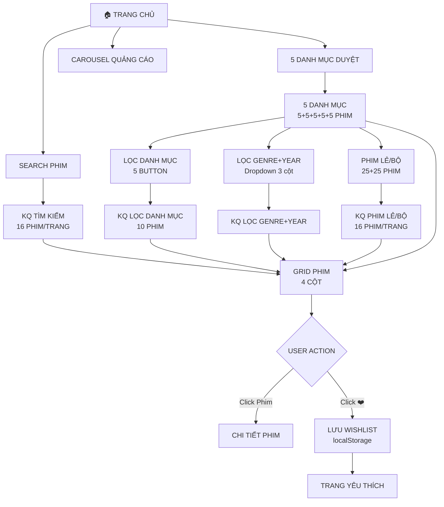

---

### **2. Sơ Đồ Luồng Dữ Liệu (Data Flow)**

```
┌─────────────────────────────────────────────────────────────┐
│                    DATA FLOW DIAGRAM                        │
└─────────────────────────────────────────────────────────────┘

API SERVER (Backend)
    │
    │ GET /api/movies
    │ (50 phim JSON array)
    │
    ▼
BROWSER MEMORY (allMovies ref)
    │
    ├─────────────────────────────────────────┐
    │                                         │
    ▼                                         ▼
useMovieCategories                    useMovieSearch
(5 danh mục)                         (Tìm kiếm)
    │                                         │
    ├─ categories.new (ID 0-9)              ├─ searchQuery
    ├─ categories.hot (ID 10-19)            ├─ searchedMovies
    ├─ categories.mostViewed (ID 20-29)     ├─ searchCurrentPage
    ├─ categories.trending (ID 30-39)       ├─ (16 phim/trang)
    └─ categories.today (ID 40-49)          └─ (phân trang)
    (5 phim/trang, 2 trang)
    │
    ├────────────────────────────────────────────────────┐
    │                                                    │
    ▼                                                    ▼
useMovieFilter                                useMovieCategoryFilter
(Thể loại + Năm)                            (Lọc danh mục)
    │                                         │
    ├─ activeGenreFilters                    ├─ selectedCategory
    ├─ activeYearFilters                     ├─ categoryFilteredMovies
    ├─ filteredMovies                        ├─ (16 phim/trang)
    └─ (16 phim/trang)                       └─ (phân trang)
    │
    └─────────────────────┬──────────────────┬──────────┘
                          │                  │
                          ▼                  ▼
                    useMovieTypeFilter    localStorage
                    (Phim Lẻ/Bộ)          (Favorites)
                    (25+25 phim)               │
                    (16 phim/trang)            ├─ Key: "favorites"
                                               ├─ Value: "[1,5,12,...]"
                                               └─ Persistent
                                                   │
                                                   ▼
                                            TRANG YÊU THÍCH
                                            (Wishlist Page)
```

**Mermaid Code (Draw.io):**
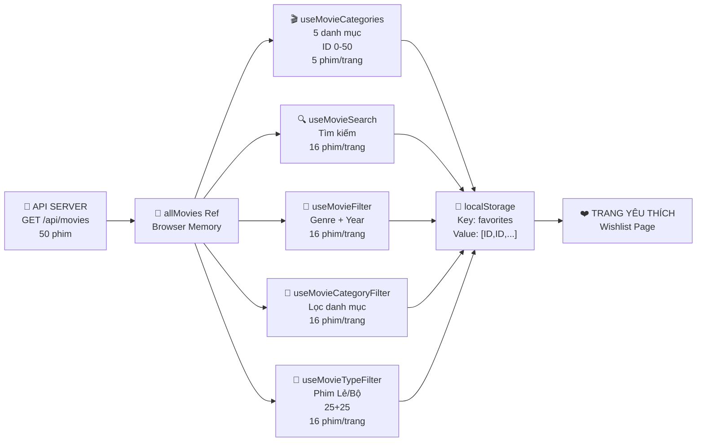

---

### **3. Sơ Đồ Thành Phần (Component Architecture)**

```
┌─────────────────────────────────────────────────────────────┐
│                    COMPONENT TREE                           │
└─────────────────────────────────────────────────────────────┘

app.vue (Root)
    │
    └─ layout/default.vue (Header + Sidebar)
            │
            ├─ Header Components:
            │  ├─ Logo (KHANLIX)
            │  ├─ Menu (Trang Chủ, Phim Lẻ, Phim Bộ)
            │  ├─ Dropdown Danh Mục (Genre, Year, Khác)
            │  ├─ Search Bar
            │  ├─ Favorites Icon (❤️)
            │  ├─ History Icon (⏰)
            │  └─ Auth Buttons
            │
            └─ pages/index.vue (Trang Chủ → Gồm 4 chế độ)
                    │
                    ├─ Mode 1: DANH MỤC (Mặc định)
                    │   ├─ Carousel Quảng Cáo
                    │   ├─ Trending Hôm Nay
                    │   │  └─ MovieCard × 5
                    │   │  └─ Pagination
                    │   ├─ Phim Mới Cập Nhật
                    │   │  └─ MovieCard × 5
                    │   │  └─ Pagination
                    │   ├─ Phim Hot Hiện Tại
                    │   │  └─ MovieCard × 5
                    │   │  └─ Pagination
                    │   ├─ Phim Được Xem Nhiều
                    │   │  └─ MovieCard × 5
                    │   │  └─ Pagination
                    │   └─ Phim Lẻ Mới Ra Mắt
                    │      └─ MovieCard × 5
                    │      └─ Pagination
                    │
                    ├─ Mode 2: TÌM KIẾM
                    │   ├─ Result Header (searched 32 movies)
                    │   ├─ MovieCard × 16
                    │   └─ Pagination [1] [2]
                    │
                    ├─ Mode 3: LỌC THỂ LOẠI + NĂM
                    │   ├─ Filter Panel (Genre, Year)
                    │   ├─ MovieCard × 16
                    │   └─ Pagination
                    │
                    ├─ Mode 4: LỌC DANH MỤC (NEW)
                    │   ├─ Category Select (5 buttons)
                    │   ├─ MovieCard × 10 (16/page)
                    │   └─ Pagination
                    │
                    └─ Mode 5: PHIM LẺ/BỘ
                        ├─ Type (Single = 25, Series = 25)
                        ├─ MovieCard × 16
                        └─ Pagination
                    
            └─ pages/favorites.vue (Trang Yêu Thích)
                    ├─ Favorites Header (3 phim)
                    ├─ MovieCard × N (yêu thích)
                    └─ Remove Button (❌)

MovieCard Component (Reusable)
    ├─ Poster Image
    ├─ Title
    ├─ Rating
    ├─ Year
    ├─ Genre
    ├─ Favorite Icon (❤️)
    └─ Click Handlers
```

**Mermaid Code:**
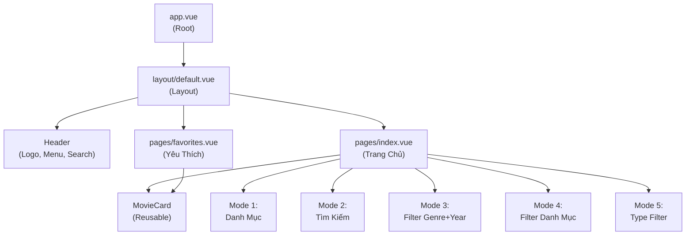

---

### **4. Sơ Đồ API & Endpoints**

```
┌─────────────────────────────────────────────────────────────┐
│                    API ENDPOINTS                            │
└─────────────────────────────────────────────────────────────┘

SERVER: /server/api/movies.ts

GET /api/movies
├─ Query Parameters:
│  ├─ search?: "avatar" (tìm kiếm)
│  ├─ genre?: "Hành động" (lọc thể loại)
│  ├─ year?: "2024" (lọc năm)
│  └─ type?: "single/series" (lọc loại)
│
├─ Response (Success):
│  └─ [
│      { id: 1, title: "...", poster: "...", genre: "...", year: "...", rating: 9.0 },
│      { id: 2, title: "...", ... },
│      ...
│    ]
│
└─ Response (Error):
   └─ { error: "Something went wrong" }

EXAMPLES:
─────────
1. GET /api/movies
   → Return all 50 movies
   
2. GET /api/movies?search=avatar
   → Return movies with "avatar" in title/genre
   
3. GET /api/movies?genre=Hành động
   → Return movies with genre "Hành động"
   
4. GET /api/movies?genre=Hành động&year=2024
   → Return movies with BOTH conditions
   
5. GET /api/movies?type=single
   → Return 25 single movies (ID 1-25)
   
6. GET /api/movies?type=series
   → Return 25 series movies (ID 26-50)
```

**Mermaid Code:**
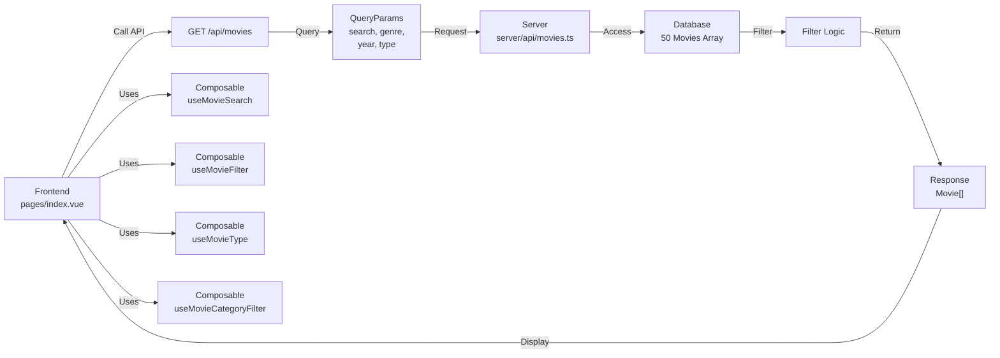

---

### **5. Sơ Đồ Luồng Yêu Thích (Favorites Flow)**

```
┌─────────────────────────────────────────────────────────────┐
│                    FAVORITES FLOW                           │
└─────────────────────────────────────────────────────────────┘

BROWSER                           localStorage
  │                                  │
  │ Movie Card ❤️ (not clicked)      │
  │      │                           │
  │      └─ Click ❤️                 │
  │           │                      │
  │           ▼                      │
  │      Add to Favorites ──────────→│ Save: favorites = "[1,5,12,33]"
  │           │                      │
  │           ▼                      │
  │      ❤️ Filled (Red)             │
  │           │                      │
  │ (Click again)◄──────────Reload F5─┤ (Persistent)
  │      │                           │
  │      └─ Click ❤️ (Remove)        │
  │           │                      │
  │           ▼                      │
  │      Remove from Favorites ─────→│ Update: favorites = "[5,12,33]"
  │           │                      │
  │           ▼                      │
  │      ❤️ Empty (Gray)             │
  │           │                      │
  └───────────┘                      │
                                     │
              ┌──────────────────────┘
              │
    User visits /favorites
              │
              ▼
    Read from localStorage
              │
              ▼
    Display Wishlist Movies
              │
              ├─ Movie 1 (ID 5) ❌
              ├─ Movie 2 (ID 12) ❌
              └─ Movie 3 (ID 33) ❌
              
    (Click ❌ to remove)
```

**Mermaid Code:**
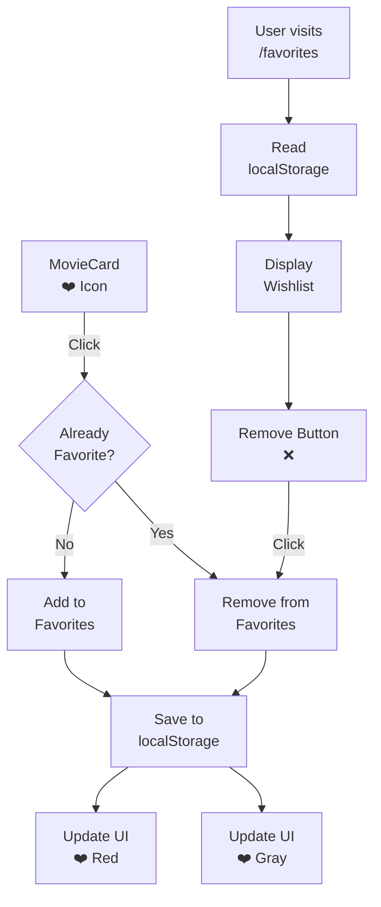


---

## 🎨 Khung Giao Diện (Wireframe)

### **1. Header & Navigation**

```
┌─────────────────────────────────────────────────────────────────────┐
│ 🎬 KHANLIX │ [Trang Chủ] [Phim Lẻ] [Phim Bộ] [▼ Danh Mục] │ 🔍 Search │ ❤️ 🕐 │ Đăng Nhập │
└─────────────────────────────────────────────────────────────────────┘

Dropdown Danh Mục (when clicked):
┌────────────────────────────────────────────┐
│ CỘT 1: THỂ LOẠI │ CỘT 2: NĂM │ CỘT 3: KHÁC │
├────────────────────────────────────────────┤
│ ☑ Hành Động     │ ☑ 2024   │ ☑ Top Films │
│ ☑ Hài           │ ☑ 2023   │ ☑ New Films │
│ ☑ Kinh Dị       │ ☑ 2022   │ ☑ Trending  │
│ ☑ Tâm Lý        │ ☑ 1994   │             │
│ ...             │ ...      │             │
└────────────────────────────────────────────┘
```

**PlantUML Code:**
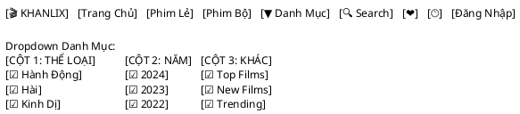

---

### **2. Trang Chủ - Mode Danh Mục**

```
┌────────────────────────────────────────────────────────┐
│        🎬 CAROUSEL QUẢNG CÁO (4 Slides)               │
│                                                        │
│  [Gradient BG] [Icon] Khám Phá Bộ Sưu Tập            │
│                                         [◀ ● ● ● ●▶]  │
└────────────────────────────────────────────────────────┘

┌────────────────────────────────────────────────────────┐
│ ✨ Trending Hôm Nay (10 phim, 2 trang)                │
├────────────────────────────────────────────────────────┤
│ ┌─────────┐ ┌─────────┐ ┌─────────┐ ┌─────────┐     │
│ │ Poster  │ │ Poster  │ │ Poster  │ │ Poster  │     │
│ │ Title   │ │ Title   │ │ Title   │ │ Title   │     │
│ │ Rating  │ │ Rating  │ │ Rating  │ │ Rating  │     │
│ │  ❤️      │ │  ❤️      │ │  ❤️      │ │  ❤️      │     │
│ └─────────┘ └─────────┘ └─────────┘ └─────────┘     │
│        [◀ Prev] [1] [2] [Next▶]                      │
└────────────────────────────────────────────────────────┘

┌────────────────────────────────────────────────────────┐
│ 🎬 Phim Mới Cập Nhật (10 phim, 2 trang)              │
├────────────────────────────────────────────────────────┤
│ ┌─────────┐ ┌─────────┐ ┌─────────┐ ┌─────────┐     │
│ │ Poster  │ │ Poster  │ │ Poster  │ │ Poster  │     │
│ │ Title   │ │ Title   │ │ Title   │ │ Title   │     │
│ │ Rating  │ │ Rating  │ │ Rating  │ │ Rating  │     │
│ │  ❤️      │ │  ❤️      │ │  ❤️      │ │  ❤️      │     │
│ └─────────┘ └─────────┘ └─────────┘ └─────────┘     │
│        [◀ Prev] [1] [2] [Next▶]                      │
└────────────────────────────────────────────────────────┘

(Tương tự: 3 danh mục còn lại)
```

**PlantUML Code:**
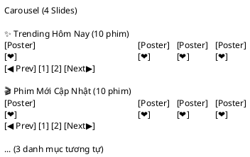

---

### **3. Trang Chủ - Mode Lọc Danh Mục (NEW)**

```
┌───────────────────────────────────────────────────────────┐
│ Lọc Theo Danh Mục:                                        │
│ [ Phim Mới ] [ Phim Hot ] [ Xem Nhiều ] [ Trending ] [ Lẻ Mới ]
└───────────────────────────────────────────────────────────┘

(Sau khi click "Phim Hot")

┌───────────────────────────────────────────────────────────┐
│ Phim Hot Hiện Tại (10 phim) [← Quay Lại Danh Mục]          │
├───────────────────────────────────────────────────────────┤
│ ┌─────────┐ ┌─────────┐ ┌─────────┐ ┌─────────┐         │
│ │ Poster  │ │ Poster  │ │ Poster  │ │ Poster  │         │
│ │  ID 11  │ │  ID 12  │ │  ID 13  │ │  ID 14  │         │
│ │  ❤️      │ │  ❤️      │ │  ❤️      │ │  ❤️      │         │
│ └─────────┘ └─────────┘ └─────────┘ └─────────┘         │
│                                                           │
│ ┌─────────┐ ┌─────────┐ ┌─────────┐ ┌─────────┐         │
│ │ Poster  │ │ Poster  │ │ Poster  │ │ Poster  │         │
│ │  ID 15  │ │  ID 16  │ │  ...    │ │  ...    │         │
│ │  ❤️      │ │  ❤️      │ │  ❤️      │ │  ❤️      │         │
│ └─────────┘ └─────────┘ └─────────┘ └─────────┘         │
│                                                           │
│     [◀ Prev] [1] [Next▶]    (Phân trang 16 phim/trang) │
└───────────────────────────────────────────────────────────┘
```

**PlantUML Code:**
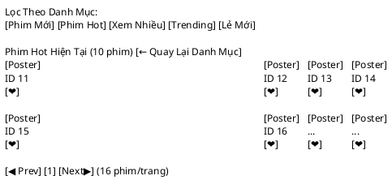

---

### **4. Trang Tìm Kiếm & Kết Quả**

```
┌───────────────────────────────────────────────────────────┐
│ Header: [🔍 Search "Avatar"]                              │
│ Kết Quả Tìm Kiếm: Avatar (2 phim)                        │
├───────────────────────────────────────────────────────────┤
│ ┌─────────┐ ┌─────────┐ ┌─────────┐ ┌─────────┐         │
│ │ Poster  │ │ Poster  │ │         │ │         │         │
│ │ Avatar  │ │Avatar 2 │ │         │ │         │         │
│ │  ❤️      │ │  ❤️      │ │         │ │         │         │
│ └─────────┘ └─────────┘ └─────────┘ └─────────┘         │
│                                                           │
│     [◀ Prev] [1] [Next▶] (Phân trang 16 phim/trang)    │
└───────────────────────────────────────────────────────────┘
```

**PlantUML Code:**
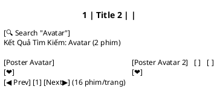

---

### **5. Trang Lọc Genre & Năm**

```
┌───────────────────────────────────────────────────────────┐
│ Filter Panel:                                             │
│ ☑ Hành Động  ☑ 2024   ☑ Top Films  [Clear All]         │
└───────────────────────────────────────────────────────────┘

┌───────────────────────────────────────────────────────────┐
│ Kết Quả Lọc: Hành Động + 2024 (5 phim)                   │
├───────────────────────────────────────────────────────────┤
│ ┌─────────┐ ┌─────────┐ ┌─────────┐ ┌─────────┐         │
│ │ Poster  │ │ Poster  │ │ Poster  │ │         │         │
│ │ Title   │ │ Title   │ │ Title   │ │         │         │
│ │  ❤️      │ │  ❤️      │ │  ❤️      │ │         │         │
│ └─────────┘ └─────────┘ └─────────┘ └─────────┘         │
│                                                           │
│     [◀ Prev] [1] [Next▶] (Phân trang 16 phim/trang)    │
└───────────────────────────────────────────────────────────┘
```

**PlantUML Code:**
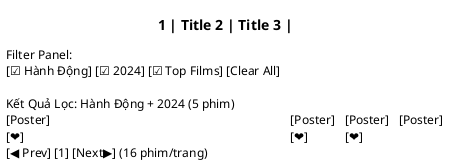

---

### **6. Trang Yêu Thích (Favorites)**

```
┌───────────────────────────────────────────────────────────┐
│ ❤️ Phim Yêu Thích (5 phim)                                │
├───────────────────────────────────────────────────────────┤
│ ┌─────────┐ ┌─────────┐ ┌─────────┐ ┌─────────┐         │
│ │ Poster  │ │ Poster  │ │ Poster  │ │ Poster  │         │
│ │ Title   │ │ Title   │ │ Title   │ │ Title   │         │
│ │ ❌ Remove│ │ ❌ Remove│ │ ❌ Remove│ │ ❌ Remove│         │
│ └─────────┘ └─────────┘ └─────────┘ └─────────┘         │
│                                                           │
│ ┌─────────┐                                              │
│ │ Poster  │                                              │
│ │ Title   │                                              │
│ │ ❌ Remove│                                              │
│ └─────────┘                                              │
│                                                           │
│ [Clear All Favorites]                                    │
└───────────────────────────────────────────────────────────┘
```

**PlantUML Code:**
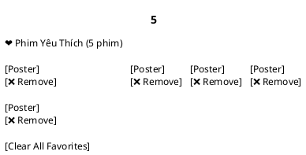

---

### **7. Movie Card (Component)**

```
┌──────────────────┐
│    Poster        │
│   400x600px      │
├──────────────────┤
│ Title            │
│ Rating: ⭐ 8.5   │
│ Year: 2024       │
│ Genre: Hành động,│
│        Hài       │
│                  │
│ ❤️ (Add to Fav) │
└──────────────────┘
```

**PlantUML Code:**
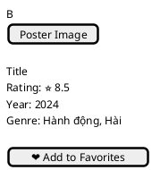


---

## 🏗️ Kiến Trúc Thành Phần

### **Folder Structure**

```
movie-app/
├── app.vue
├── nuxt.config.ts
├── package.json
│
├── components/          # Reusable Components
│   ├── MovieCard.vue
│   ├── LoadingSpinner.vue
│   └── ...
│
├── composables/         # Business Logic
│   ├── useMovieCategories.ts        (F1: 5 danh mục)
│   ├── useMovieCategoryFilter.ts    (F2: Lọc danh mục)
│   ├── useMovieSearch.ts            (F3: Tìm kiếm)
│   ├── useMovieFilter.ts            (F4: Lọc genre+year)
│   ├── useMovieTypeFilter.ts        (F5: Phim lẻ/bộ)
│   └── ...
│
├── pages/              # Page Components
│   ├── index.vue       (Trang chủ - 4 chế độ)
│   ├── favorites.vue   (F6: Yêu thích)
│   └── ...
│
├── server/
│   └── api/
│       └── movies.ts   (API endpoint)
│
├── stores/            # Pinia State Management
│   └── favoriteStore.ts (Quản lý yêu thích)
│
├── layouts/
│   └── default.vue    (Header + Layout)
│
├── assets/
│   └── css/
│       └── main.css
│
└── example/
    ├── DEPLOYMENT_AND_DEMO.md
    └── SYSTEM_DESIGN.md (file này)
```

---

<!-- ## 💻 Công Nghệ Sử Dụng

### **Frontend Stack**

| Công Nghệ | Phiên Bản | Mục Đích |
|----------|---------|---------|
| **Vue** | 3.5.30 | UI Framework |
| **Nuxt** | 3.4.2 | Meta Framework |
| **TypeScript** | Latest | Type Safety |
| **Tailwind CSS** | 3.x | Styling |
| **Pinia** | 3.0.4 | State Management |
| **Vue Router** | 5.0.3 | Routing |
| **Nuxt Image** | 2.0.0 | Image Optimization |
| **Nuxt Icon** | 2.2.1 | Icons |

### **Backend Stack**

| Công Nghệ | Mục Đích |
|----------|---------|
| **Nuxt Server** | API Server |
| **h3** | HTTP Framework |
| **Node.js** | Runtime |

### **Storage**

| Storage | Mục Đích |
|---------|---------|
| **localStorage** | Lưu yêu thích (Favorites) |
| **sessionStorage** | (Optional) Lưu trạng thái tạm |
| **JSON API** | Mock data (server/api/movies.ts) |

--- -->

## 📊 Data Model

### **Movie Schema**

```typescript
interface Movie {
  id: number                    // 1-50
  title: string                 // "Lật Mặt 7"
  poster: string                // "/images/posters/..."
  year: string                  // "2024"
  genre: string                 // "Tâm Lý, Gia Đình"
  rating: number                // 9.0
  synopsis: string              // Mô tả chi tiết
  trailerUrl: string            // YouTube URL
  type?: "single" | "series"    // Phim lẻ or bộ
}
```

### **Category Schema**

```typescript
interface Category {
  name: string                  // "Phim Mới Cập Nhật"
  startIndex: number            // 0
  endIndex: number              // 10
  currentPage: Ref<number>      // 1 or 2
}

// 5 categories
categories = {
  new: { startIndex: 0, endIndex: 10 },
  hot: { startIndex: 10, endIndex: 20 },
  mostViewed: { startIndex: 20, endIndex: 30 },
  trending: { startIndex: 30, endIndex: 40 },
  today: { startIndex: 40, endIndex: 50 }
}
```

### **Favorites Schema**

```typescript
// localStorage
{
  "favorites": "[1, 5, 12, 33, 45]"  // Array of movie IDs
}
```

---

## 🎬 Summary

| Thành Phần | Mô Tả |
|-----------|--------|
| **6 Chức Năng** | Duyệt, Lọc (3 cách), Tìm kiếm, Yêu thích |
| **5 Danh Mục** | 50 phim chia 5 × 10 phim |
| **Phân Trang** | 5 phim/trang (danh mục), 16 phim/trang (search/filter) |
| **Responsive** | Desktop, Tablet, Mobile |
| **Tech Stack** | Vue 3, Nuxt 3, TypeScript, Tailwind, Pinia |
| **Storage** | localStorage (yêu thích) |
| **API** | 1 endpoint: `/api/movies` |
| **Performance** | < 2s load, < 500ms API |

---

*Generated: 2026-03-28*
**System Design Document v1.0**

